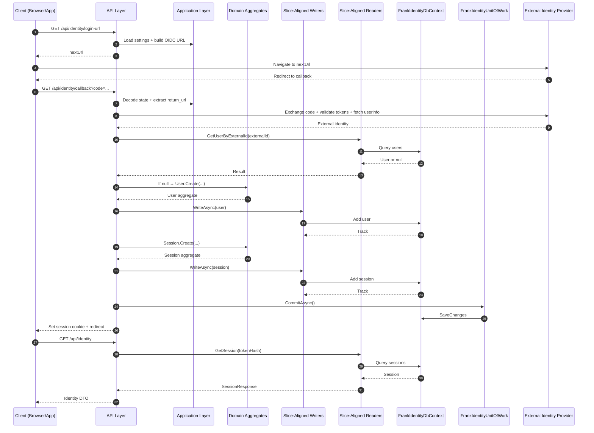

# Frank.Identity — Developer Guide  
## Overview

Frank.Identity is a vertical‑slice, domain‑driven authentication subsystem designed for Camp Fit Fur Dogs.  
It provides:

- External authentication (OIDC)
- Domain‑driven user identity
- Deterministic session management
- Slice‑aligned persistence (readers + writers)
- A clean separation between:
  - **API**
  - **Application**
  - **Domain**
  - **Infrastructure**
  - **EntityFrameworkCore**

Frank.Identity is intentionally **minimal**, **predictable**, and **composable**.  
Every slice is self‑contained, testable, and aligned with the vertical‑slice architecture.

---

# 1. Architecture Overview

Frank.Identity is composed of four major subsystems:

### **1. Authentication**
OIDC login, callback, logout, and identity projection.

### **2. Users**
Domain user model, creation, lookup, and external identity resolution.

### **3. Sessions**
Authentication session lifecycle: create, retrieve, revoke.

### **4. Infrastructure**
EF Core persistence, DbContext, UnitOfWork, and slice‑aligned readers/writers.

---

# 2. FrankIdentityDbContext

**Location:**  
```
Frank.Identity.EntityFrameworkCore.FrankIdentityDbContext.cs
```

### Responsibilities

- Exposes all Identity aggregates:
  - `DbSet<User>`
  - `DbSet<Session>`
- Applies all EF Core configurations:
  - `UserConfiguration`
  - `SessionConfiguration`
- Serves as the persistence boundary for all slices
- Tracks changes for writers
- Works together with `FrankIdentityUnitOfWork` for atomic commits

### Developer Notes

- DbContext **never commits** — writers only add/modify aggregates.
- All commits flow through **FrankIdentityUnitOfWork**.
- All reads use `AsNoTracking` for performance.

---

# 3. FrankIdentityUnitOfWork

**Location:**  
```
Frank.Identity.EntityFrameworkCore.FrankIdentityUnitOfWork.cs
```

### Responsibilities

- Commit all EF Core changes atomically
- Provide transactional boundaries for slices
- Ensure consistency across multi‑step flows (e.g., callback pipeline)

### API

```csharp
Task CommitAsync(CancellationToken ct);
```

### Developer Notes

- Writers never call `SaveChangesAsync`.
- UnitOfWork is the **only** component allowed to commit.
- Supports batching (e.g., create user + create session).

---

# 4. Subsystem Guides

Frank.Identity is organized into subsystem‑level guides:

### **Authentication**
- [GetLoginUrl](./authentication/get-login-url/README.md)
- [Callback](./authentication/callback/README.md)
- [Logout](./authentication/logout/README.md)
- [GetIdentity](./authentication/get-identity/README.md)

### **Users**
- [CreateUser](./users/create-user/README.md)
- [GetUserByExternalId](./users/get-user-by-external-id/README.md)
- [GetUserById](./users/get-user-by-id/README.md)

### **Sessions**
- [Sessions Overview](./sessions/README.md)
- [CreateSession](./sessions/create-session/README.md)
- [GetSession](./sessions/get-session/README.md)
- [RevokeSession](./sessions/revoke-session/README.md)

---

# 5. Unified Identity Flow (Sequence Diagram)



---

# 6. Philosophy

Frank.Identity is designed to be:

- **Vertical‑slice aligned** — each slice is self‑contained and testable  
- **Domain‑driven** — aggregates + value objects enforce invariants  
- **Predictable** — deterministic session expiration  
- **Composable** — slices can be combined into larger flows  
- **Minimal** — no complex token formats or magic behavior  
- **Explicit** — all persistence flows through writers + UnitOfWork  
- **Transparent** — all reads use projection DTOs  

---

# 7. Quick Navigation

### Authentication
- [GetLoginUrl](./authentication/get-login-url/README.md)
- [Callback](./authentication/callback/README.md)
- [Logout](./authentication/logout/README.md)
- [GetIdentity](./authentication/get-identity/README.md)

### Users
- [CreateUser](./users/create-user/README.md)
- [GetUserByExternalId](./users/get-user-by-external-id/README.md)
- [GetUserById](./users/get-user-by-id/README.md)

### Sessions
- [Sessions Overview](./sessions/README.md)
- [CreateSession](./sessions/create-session/README.md)
- [GetSession](./sessions/get-session/README.md)
- [RevokeSession](./sessions/revoke-session/README.md)
