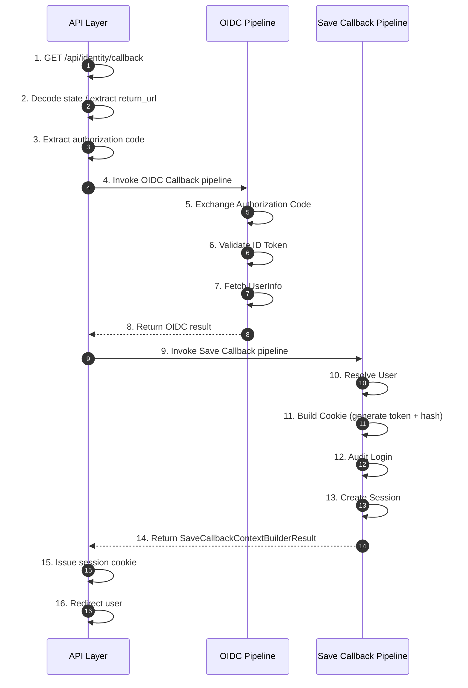

# Frank.Identity — Callback Slice  
## Developer Guide

The **Callback** slice implements the full authentication callback flow for Frank.Identity.  
It spans all layers of the Identity subsystem:

```
Identity/
  Api/
  Application/
  Domain/
  Infrastructure/
  EntityFrameworkCore/
```

This guide documents the slice end‑to‑end for developers implementing, maintaining, or extending the callback flow.

---

# 1. End‑to‑End Execution Flow (Overview)

The callback flow consists of three cooperating layers:

- **API Layer** — orchestrates the flow  
- **OIDC Pipeline** — handles protocol concerns  
- **Save Callback Pipeline** — handles business concerns  



### Section Links

- **API Layer:**  
  - [CallbackEndpoint](#2-callbackendpoint-api-layer)

- **OIDC Pipeline:**  
  - [Exchange Authorization Code](#3-oidc-callback-pipeline-protocol-layer)  
  - [Validate ID Token](#3-oidc-callback-pipeline-protocol-layer)  
  - [Fetch UserInfo](#3-oidc-callback-pipeline-protocol-layer)

- **Save Callback Pipeline:**  
  - [Resolve User](#4-save-callback-pipeline-business-layer)  
  - [Build Cookie](#4-save-callback-pipeline-business-layer)  
  - [Audit Login](#4-save-callback-pipeline-business-layer)  
  - [Create Session](#4-save-callback-pipeline-business-layer)

---

# 2. CallbackEndpoint (Api Layer)

Location:

```
Frank/Identity/Api/Endpoints/CallbackEndpoint.cs
```

### Responsibilities

- Decode `state`  
- Extract `return_url`  
- Extract authorization code  
- Invoke OIDC pipeline → `OidcCallbackContextBuilderResult`  
- Invoke Save Callback pipeline → `SaveCallbackContextBuilderResult`  
- Issue session cookie  
- Redirect user  

### Developer Notes

- The API layer performs **no business logic**.  
- It is the **orchestrator** between the two pipelines.  
- Cookie issuance is the only side effect.

### Key excerpt

```csharp
var oidcCallbackResult =
    await oidcContextBuilder.BuildAsync(oidcCallbackRequest, ct);

var appAuthCallbackResult =
    await saveContextBuilder.BuildAsync(appAuthCallbackRequest, ct);

http.Response.Cookies.Append("session", appAuthCallbackResult.CookieValue, ...);

return Results.Redirect(returnUrl);
```

---

# 3. OIDC Callback Pipeline (Protocol Layer)

Location:

```
Frank/Identity/Application/Abstractions/Callback/Oidc/*
Frank/Identity/Application/Callback/Oidc/*
```

### Responsibilities

- Exchange authorization code  
- Validate ID token  
- Fetch userinfo  
- Normalize identity  
- Produce `OidcCallbackContextBuilderResult`

### Steps

#### 5. Exchange Authorization Code  
`ExchangeCodeStep`  
- POST `/oauth/token`  
- Extract `access_token` and `id_token`

#### 6. Validate ID Token  
`ValidateTokensStep`  
- Validate issuer, audience, signature, lifetime  
- Extract subject + claims

#### 7. Fetch UserInfo  
`FetchUserInfoStep`  
- GET `/userinfo`  
- Extract profile attributes

### Notes

- This pipeline is **pure protocol handling**.  
- It produces the **external identity** consumed by the Save Callback pipeline.

---

# 4. Save Callback Pipeline (Business Layer)

Location:

```
Frank/Identity/Application/Abstractions/Callback/Save/*
Frank/Identity/Application/Callback/Save/*
```

This pipeline performs all business logic required to authenticate a user.

### Context

```csharp
public sealed record SaveCallbackContext : ImmutableContextBase
{
    public required OidcCallbackContextBuilderResult External { get; init; }
    public required DateTimeOffset Now { get; init; }

    public Guid? UserId { get; init; }
    public Guid? SessionId { get; init; }
    public string? TokenHash { get; init; }
    public string? CookieValue { get; init; }
}
```

### Steps

#### 10. Resolve User  
`ResolveUserStep`  
- Lookup user by external identity  
- Create user if first login  
- Set `UserId`

#### 11. Build Cookie  
`BuildCookieStep`  
- Generate session token  
- Hash token  
- Build opaque cookie value  
- Set `TokenHash` + `CookieValue`

#### 12. Audit Login  
`AuditLoginStep`  
- Log successful login  
- Uses external subject + internal `UserId`

#### 13. Create Session  
`CreateSessionStep`  
- Create session aggregate  
- Persist session  
- Commit unit of work  
- Set `SessionId`

### Notes

- Each step is **pure** and returns a new immutable context.  
- No side effects occur outside the unit of work commit.

---

# 5. User Aggregate (Domain Layer)

Location:

```
Frank/Identity/Domain/Users/*
```

### Responsibilities

- Represent authenticated identity  
- Enforce invariants  
- Created only on first login  
- Looked up by external identity (`sub`)

### Notes

- The User aggregate is the canonical identity representation in Frank.Identity.

---

# 6. Session Aggregate (Domain Layer)

Location:

```
Frank/Identity/Domain/Sessions/*
```

### Responsibilities

- Represent authenticated session  
- Store hashed session token  
- Enforce expiration  
- Link to `UserId`  
- Created on every login

### Notes

- Raw tokens are never persisted — only hashes.

---

# 7. Infrastructure Layer

## IdentityResolver

Location:

```
Frank/Identity/Infrastructure/IdentityResolver.cs
```

### Responsibilities

- Resolve user by external identity  
- Create user when needed  
- Coordinate with repositories  
- Return internal `UserId`

---

# 8. EntityFrameworkCore Layer

## User Repository

Location:

```
Frank/Identity/EntityFrameworkCore/Users/*
```

### Responsibilities

- Persist User  
- Query by external identity  
- Enforce uniqueness  

## Session Repository

Location:

```
Frank/Identity/EntityFrameworkCore/Sessions/*
```

### Responsibilities

- Persist session  
- Store hashed token  
- Enforce expiration  
- Retrieve active sessions  

---

# 9. Testing Strategy

### Unit Tests

- Exchange code  
- Validate tokens  
- Fetch userinfo  
- Resolve user  
- Build cookie  
- Audit login  
- Create session  

### Pipeline Tests

- Full OIDC pipeline  
- Full Save Callback pipeline  
- Correct ordering  
- Correct invariants  
- Correct context transitions  

### Integration Tests

- Full callback flow  
- User creation on first login  
- User reuse on subsequent login  
- Session creation  
- Cookie issuance  
- Redirect correctness  

Integration tests use `ApiContext` + `ApiFactory`.

---

# 10. Developer Notes

- Protocol concerns → OIDC pipeline  
- Business concerns → Save Callback pipeline  
- API must remain thin  
- Domain aggregates enforce invariants  
- EFCore persists aggregates  
- Infrastructure provides clean abstractions  
- Pipelines must remain deterministic and side‑effect‑free  
- API boundary is the only place where cookies + redirects occur  

---

# 11. Summary

The **Callback** slice:

- receives OIDC callback  
- normalizes external identity  
- resolves or creates User  
- builds cookie  
- audits login  
- creates session  
- returns a cohesive result to the API  
- issues the real Frank session cookie  
- redirects the user

This is the complete developer guide for the **Callback** vertical slice.
