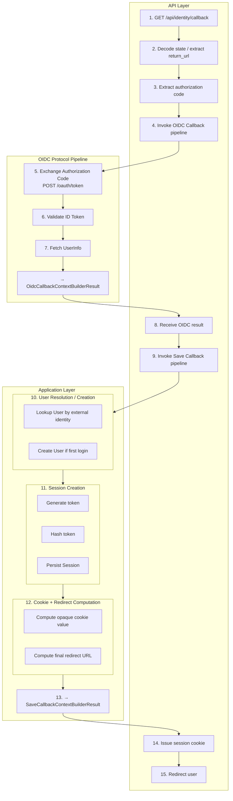

# Frank.Identity — Callback Slice  
## Developer Guide

The **Callback** slice handles the complete authentication callback flow. It spans all Identity layers:

```
Identity/
  Api/
  Application/
  Domain/
  Infrastructure/
  EntityFrameworkCore/
```

This guide documents the slice end‑to‑end for developers implementing, maintaining, or extending the callback flow.

---

# 1. End‑to‑End Execution Flow (Overview)

This is the complete execution sequence for the Callback slice.  
Each step links to the section where it is implemented.



### Section Links

- **API Lane:**  
  - [CallbackEndpoint (Api Layer)](#callbackendpoint-api-layer)

- **OIDC Protocol Lane:**  
  - [OIDC Callback Pipeline (Protocol Layer)](#oidc-callback-pipeline-protocol-layer)  
    - 4a. Exchange Authorization Code  
    - 4b. Validate ID Token  
    - 4c. Fetch UserInfo  

- **Application Lane:**  
  - [Save Callback Pipeline (Business Layer)](#save-callback-pipeline-business-layer)  
    - 5a. User Resolution / Creation  
    - 5b. Session Creation  
    - 5c. Cookie + Redirect Computation  


---

# 2. CallbackEndpoint (Api Layer)

Location:

```
Frank/Identity/Api/Endpoints/CallbackEndpoint.cs
```

### Responsibilities

- Decode `state`  
- Extract `return_url`  
- Extract authorization code  
- Run OIDC pipeline → `OidcCallbackContextBuilderResult`  
- Run Save Callback pipeline → `SaveCallbackContextBuilderResult`  
- Issue session cookie  
- Redirect user  

### Developer Notes

- The endpoint performs **no business logic**.  
- All identity and session decisions occur in Application.  
- Cookie issuance is the only side effect in Api.

### Key excerpt

```csharp
var oidcCallbackResult =
    await frankEngine.BuildAsync(oidcCallbackRequest, CancellationToken.None);

var appAuthCallbackResult =
    await appEngine.BuildAsync(appAuthCallbackRequest, CancellationToken.None);

http.Response.Cookies.Append("session", appAuthCallbackResult.CookieValue, ...);

return Results.Redirect(returnUrl);
```

---

# 3. OIDC Callback Pipeline (Protocol Layer)

Location:

```
Frank/Identity/Application/Abstractions/Callback/Oidc/*
Frank/Identity/Application/Callback/Oidc/*
```

### Responsibilities

- Exchange authorization code  
- Validate ID token  
- Fetch userinfo  
- Normalize identity  
- Produce `OidcCallbackContextBuilderResult`

This pipeline is **pure protocol handling**.

It produces the **external identity** consumed by the Save Callback pipeline.

---

# 4. Save Callback Pipeline (Business Layer)

Location:

```
Frank/Identity/Application/Abstractions/Callback/Save/*
Frank/Identity/Application/Callback/Save/*
```

This is the **core business pipeline** for authentication.

### Context

```csharp
public sealed record SaveCallbackContext : ImmutableContextBase
{
    public required OidcCallbackContextBuilderResult External { get; init; }
    public required DateTimeOffset Now { get; init; }
    public string? RequestedRedirectUrl { get; init; }

    public Guid? UserId { get; init; }
    public Guid? SessionId { get; init; }
    public string? TokenHash { get; init; }
    public string? CookieValue { get; init; }
    public string? RedirectUrl { get; init; }
}
```

### Request

```csharp
public sealed record SaveCallbackContextBuilderRequest : ImmutableContextBuilderRequestBase
{
    public required OidcCallbackContextBuilderResult External { get; init; }
    public string? RequestedRedirectUrl { get; init; }
    public required DateTimeOffset Now { get; init; }
}
```

### Result

```csharp
public sealed record SaveCallbackContextBuilderResult : ImmutableContextBuilderResultBase
{
    public required Guid UserId { get; init; }
    public required Guid SessionId { get; init; }
    public required string TokenHash { get; init; }
    public required string CookieValue { get; init; }
}
```

### Behaviors

```
IdentityMappingBehavior
UserResolutionBehavior
CreateUserBehavior
SessionCreationBehavior
RedirectComputationBehavior
CookieComputationBehavior
```

Each behavior:

- accepts an immutable context  
- returns a new immutable context  
- performs one business responsibility  
- has no external side effects  

The pipeline composes these behaviors into a deterministic flow.

---

# 5. User Aggregate (Domain Layer)

Location:

```
Frank/Identity/Domain/Users/*
```

### Responsibilities

- represent authenticated identity  
- enforce invariants  
- provide stable identity semantics  
- created only on first login  
- looked up by external identity (`sub`)  

### Developer Notes

- The Callback slice **creates a User** only when the external identity has never been seen before.  
- The User aggregate is the canonical representation of identity in Frank.Identity.

---

# 6. Session Aggregate (Domain Layer)

Location:

```
Frank/Identity/Domain/Sessions/*
```

### Responsibilities

- represent authenticated session  
- store hashed session token  
- enforce expiration  
- enforce security invariants  
- created on every login  
- linked to a `UserId`  

### Developer Notes

- The raw token is never persisted — only the hash.  
- Session creation is performed by the Save Callback pipeline.

---

# 7. Infrastructure Layer

## IdentityResolver

Location:

```
Frank/Identity/Infrastructure/IdentityResolver.cs
```

### Responsibilities

- resolve User by external identity  
- create User when needed  
- coordinate with repositories  
- return internal `UserId`

Used by the Save Callback pipeline.

---

# 8. EntityFrameworkCore Layer

## User Repository

Location:

```
Frank/Identity/EntityFrameworkCore/Users/*
```

### Responsibilities

- persist User  
- query User by external identity  
- enforce uniqueness  

---

## Session Repository

Location:

```
Frank/Identity/EntityFrameworkCore/Sessions/*
```

### Responsibilities

- persist session  
- store hashed token  
- enforce expiration  
- retrieve active sessions  

---

# 9. Testing Strategy

## Unit Tests

- identity mapping  
- User resolution  
- User creation  
- session creation  
- redirect computation  
- cookie computation  

## Pipeline Tests

- full Save Callback pipeline  
- correct ordering  
- correct invariants  
- correct context transitions  

## Integration Tests

- full callback flow  
- User creation on first login  
- User reuse on subsequent login  
- session creation  
- cookie issuance  
- redirect correctness  

Integration tests use `ApiContext` + `ApiFactory`.

---

# 10. Developer Notes

- All protocol concerns belong to the OIDC pipeline.  
- All business concerns belong to the Save Callback pipeline.  
- Api must remain a thin orchestration layer.  
- Domain aggregates must enforce invariants.  
- EFCore must persist aggregates without leaking persistence concerns upward.  
- Infrastructure must provide clean abstractions for identity resolution.  
- The slice must remain deterministic and side‑effect‑free except at the Api boundary.

---

# 11. Summary

The **Callback** slice:

- receives OIDC callback  
- normalizes external identity  
- resolves or creates User  
- creates session  
- computes redirect  
- computes cookie value  
- returns a cohesive result to the Api boundary  
- issues the real Frank session cookie  
- redirects the user

This document is the complete developer guide for the **Callback** vertical slice.
