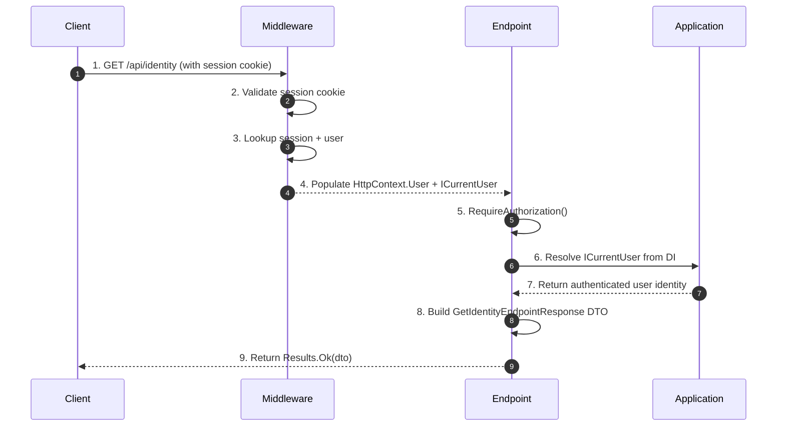

# Frank.Identity — GetIdentity Slice  
## Developer Guide

The **GetIdentity** slice exposes the authenticated user’s identity to the frontend.  
It is intentionally minimal: no pipelines, no domain logic, and no persistence.  
It simply reads the current authenticated user (`ICurrentUser`) and returns a DTO.

It spans:

- **API Layer** — `GetIdentityEndpoint`
- **Middleware Layer** — session lookup + identity resolution
- **Application Layer** — `ICurrentUser` abstraction
- **Authorization Layer** — endpoint requires authentication

---

# 1. End‑to‑End Execution Flow (Sequence Diagram)



---

# 2. GetIdentityEndpoint (API Layer)

**Location:**

```
Frank/Identity/Api/Endpoints/GetIdentityEndpoint.cs
```

**Route:**

```csharp
app.MapGet("/api/identity", (ICurrentUser currentUser) =>
{
    var dto = new GetIdentityEndpointResponse
    {
        Name = currentUser.Name!
    };

    return Results.Ok(dto);
})
.RequireAuthorization();
```

### Responsibilities

- Enforce authentication (`RequireAuthorization`)
- Resolve `ICurrentUser` from dependency injection
- Extract identity fields (currently only `Name`)
- Return a simple DTO (`GetIdentityEndpointResponse`)

### Developer Notes

- This endpoint performs **no business logic**.
- It does **not** interact with domain aggregates (`User`, `Session`).
- It does **not** touch persistence.
- It is purely a read‑only identity projection.

---

# 3. ICurrentUser (Application Layer)

The endpoint relies on the `ICurrentUser` abstraction:

```csharp
(ICurrentUser currentUser) =>
{
    var dto = new GetIdentityEndpointResponse
    {
        Name = currentUser.Name!
    };
}
```

### Responsibilities of `ICurrentUser`

- Provide the authenticated user’s identity fields
- Typically populated by:
  - Session cookie (`session`)
  - Session lookup middleware
  - Identity resolution infrastructure

### Developer Notes

- `ICurrentUser.Name` is guaranteed to be non‑null for authenticated users.
- If the session cookie is missing or invalid, authorization fails **before** the endpoint runs.

---

# 4. Authorization Requirements

The endpoint is protected:

```csharp
.RequireAuthorization();
```

### Developer Notes

- Anonymous callers cannot access `/api/identity`.
- Authorization is enforced **before** the delegate runs.
- If the session cookie is missing or invalid:
  - The request is rejected with `401 Unauthorized`.
  - The endpoint logic is never executed.

---

# 5. Response Shape

The endpoint returns:

```json
{
  "name": "Frank"
}
```

### Developer Notes

- The DTO currently exposes only `Name`.
- Additional fields (email, roles, permissions) can be added later.
- The DTO is intentionally minimal to avoid leaking internal identity details.

---

# 6. Error Handling

The endpoint itself does not throw exceptions.

Errors arise only from:

### 6.1 Authorization failures

- Missing session cookie  
- Invalid session cookie  
- Expired session  
- Session not found  

Result:

```
401 Unauthorized
```

### 6.2 Infrastructure failures

If `ICurrentUser` cannot be resolved, DI will throw — indicating a configuration error, not a runtime identity issue.

---

# 7. Testing Strategy

## Unit Tests

- Ensure `ICurrentUser` is correctly projected into `GetIdentityEndpointResponse`.
- Validate that `Name` is returned as expected.

## Integration Tests

- **Authenticated request:**
  - Provide valid session cookie
  - Expect `200 OK` with correct DTO

- **Unauthenticated request:**
  - No session cookie
  - Expect `401 Unauthorized`

- **Session invalidation:**
  - Expired or malformed cookie
  - Expect `401 Unauthorized`

Integration tests use `ApiContext` + `ApiFactory`.

---

# 8. Summary

The **GetIdentity** slice:

- Requires authentication  
- Reads the authenticated user via `ICurrentUser`  
- Returns a minimal identity DTO  
- Performs no domain logic, no persistence, and no side effects  

It is the simplest slice in Frank.Identity and serves as the frontend’s primary way to retrieve the current user’s identity.

