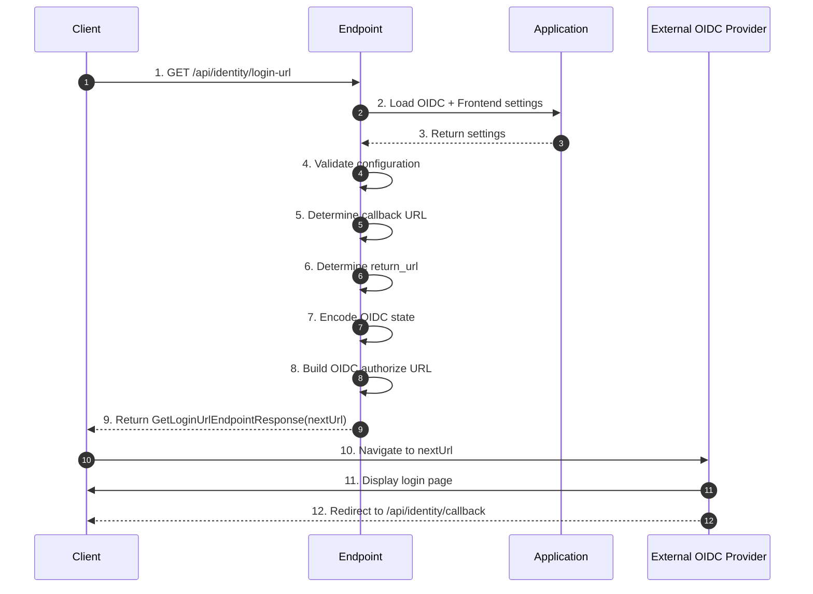

# Frank.Identity — GetLoginUrl Slice  
## Developer Guide

The **GetLoginUrl** slice initiates the authentication flow by constructing an OIDC authorization URL and returning it to the client. It spans:

- **API Layer** — `GetLoginUrlEndpoint`
- **Application Layer** — OIDC + Frontend settings
- **Domain Layer** — configuration validation exceptions
- **Protocol Layer** — OIDC authorization request to the external IdP

---

# 1. End‑to‑End Execution Flow (Sequence Diagram)



---

# 2. GetLoginUrlEndpoint (API Layer)

**Location:**

```
Frank/Identity/Api/Endpoints/GetLoginUrlEndpoint.cs
```

**Route:**

```csharp
app.MapGet("/api/identity/login-url", HandleAsync)
   .AllowAnonymous();
```

### Responsibilities

- Load OIDC + frontend settings
- Validate required configuration values
- Compute callback URL (configured or derived)
- Compute `return_url` (query or frontend base URL)
- Encode OIDC `state`
- Build the OIDC authorization URL
- Return `GetLoginUrlEndpointResponse(nextUrl)` to the client

### Key Method

```csharp
private async Task<IResult> HandleAsync(
    HttpContext http,
    IOptionsMonitor<OidcCallbackSettings> oidcOptionsMonitor,
    IOptionsMonitor<FrontendSettings> frontendOptionsMonitor,
    IConfiguration config)
```

---

# 3. Configuration (Application Layer)

## 3.1 OidcCallbackSettings

Used via:

```csharp
var oidcOptions = oidcOptionsMonitor.CurrentValue;
var authority = oidcOptions.Authority;
var clientId = oidcOptions.ClientId;
var callback = oidcOptions.CallbackUrl;
```

### Requirements

- `Authority` **must** be set  
- `ClientId` **must** be set  
- `CallbackUrl` is optional — derived from request if missing

Missing or empty values → `BadConfigurationException`.

---

## 3.2 FrontendSettings

Used via:

```csharp
var frontendBaseUrl = frontendOptionsMonitor.CurrentValue?.BaseUrl;
```

### Requirements

- `BaseUrl` must be a valid URI  
- Used as fallback `return_url`  

Missing or malformed → `BadConfigurationException`.

---

# 4. Callback URL Resolution

If `OidcCallbackSettings.CallbackUrl` is not set:

```csharp
var scheme = http.Request.Scheme;
var host = http.Request.Host.Value;
var pathBase = http.Request.PathBase.Value?.TrimEnd('/') ?? "";

callback = $"{scheme}://{host}{pathBase}/api/identity/callback";
```

### Developer Notes

- Uses request scheme + host + path base  
- Always appends `/api/identity/callback`  
- Ensures path base is normalized  

---

# 5. return_url Handling

### Client‑provided

```csharp
if (http.Request.Query.TryGetValue("return_url", out var returnUrl))
{
    if (!Uri.TryCreate(returnUrl, UriKind.RelativeOrAbsolute, out _))
        throw new BadRequestException("malformed return_url query string parameter value");
}
```

### Default (Frontend base URL)

```csharp
else
{
    if (!Uri.TryCreate(frontendBaseUrl, UriKind.RelativeOrAbsolute, out _))
        throw new BadConfigurationException("malformed Frontend:BaseUrl configuration value");

    returnUrl = frontendBaseUrl;
}
```

### Developer Notes

- Client `return_url` is validated  
- Fallback is `FrontendSettings.BaseUrl`  
- Invalid client value → `BadRequestException`  
- Invalid fallback → `BadConfigurationException`  

---

# 6. OIDC State Encoding

```csharp
var decodedState = new Dictionary<string, string>()
{
    ["return_url"] = returnUrl!
};
OidcStateEncoder.TryEncodeValue(decodedState, out var encodedState);
```

### Developer Notes

- State is JSON containing `return_url`  
- Encoded state is passed to IdP  
- Decoded later by the Callback slice  

---

# 7. OIDC Authorization URL Construction

```csharp
var scope = "openid profile email";

var nextUrl =
    $"{authority.TrimEnd('/')}/authorize" +
    $"?response_type=code" +
    $"&client_id={Uri.EscapeDataString(clientId)}" +
    $"&redirect_uri={Uri.EscapeDataString(callback)}" +
    $"&scope={Uri.EscapeDataString(scope)}" +
    $"&state={Uri.EscapeDataString(encodedState!)}";
```

### Parameters

- `response_type=code` — Authorization Code Flow  
- `client_id` — from settings  
- `redirect_uri` — callback URL  
- `scope` — fixed `"openid profile email"`  
- `state` — encoded JSON  

### Developer Notes

- All dynamic values are URI‑escaped  
- Authority is normalized  
- API does **not** redirect — frontend does  

---

# 8. Response Shape

```csharp
return Results.Ok(
    new GetLoginUrlEndpointResponse(nextUrl));
```

### Developer Notes

- Frontend receives `nextUrl`  
- Frontend performs the redirect  
- API remains pure and predictable  

---

# 9. Error Handling

### Configuration Errors

Missing or empty `Authority` or `ClientId`:

```csharp
throw new BadConfigurationException("Authentication configuration is missing or incomplete.");
```

Missing or malformed `Frontend:BaseUrl`:

```csharp
throw new BadConfigurationException("Frontend configuration is missing or incomplete.");
```

### Client Errors

Malformed `return_url`:

```csharp
throw new BadRequestException("malformed return_url query string parameter value");
```

---

# 10. Testing Strategy

## Unit Tests

- Missing OIDC settings → `BadConfigurationException`
- Missing frontend base URL → `BadConfigurationException`
- Invalid client `return_url` → `BadRequestException`
- Callback URL derivation logic
- Correct construction of `nextUrl`

## Integration Tests

- `/api/identity/login-url` returns `200 OK`
- Response contains valid `nextUrl`
- `nextUrl` contains:
  - correct authority
  - correct client_id
  - correct redirect_uri
  - correct scope
  - valid encoded state

---

# 11. Summary

The **GetLoginUrl** slice:

- Validates OIDC + frontend configuration  
- Determines callback URL  
- Determines `return_url`  
- Encodes OIDC state  
- Builds the authorization URL  
- Returns `GetLoginUrlEndpointResponse(nextUrl)`  

It is the entry point into the authentication flow, handing off to the **Callback** slice once the IdP redirects back.
