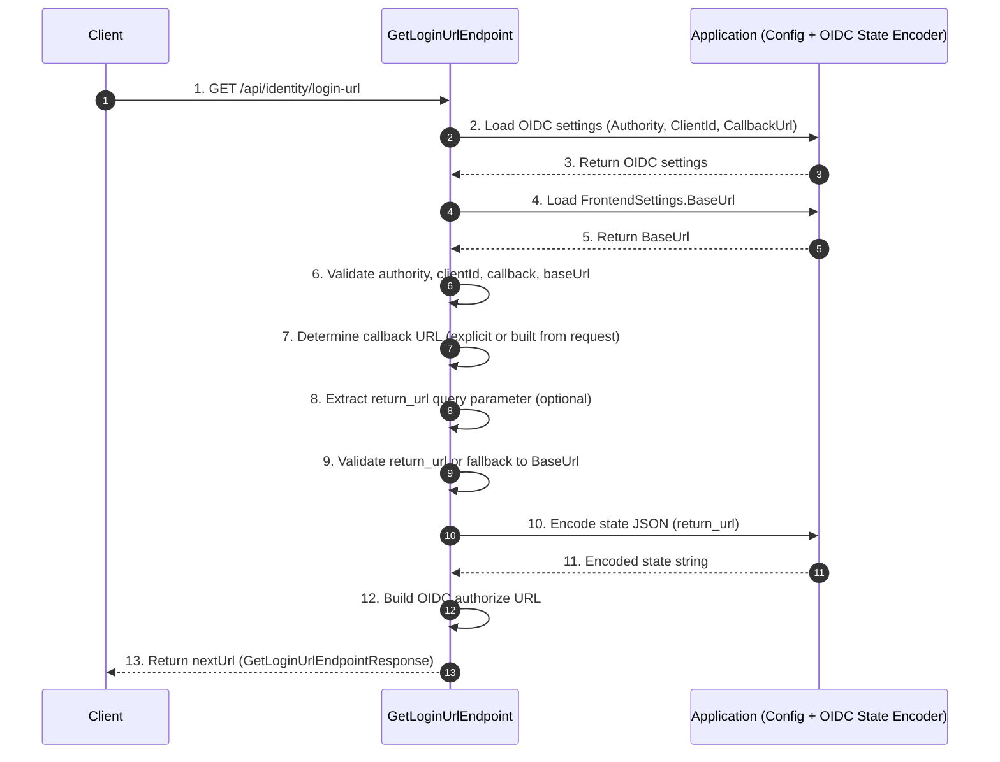

# Frank.Identity — GetLoginUrl Slice  
## Developer Guide

The **GetLoginUrl** slice generates the external identity provider (OIDC) login URL that the client should redirect to.  
It is the **entrypoint** into the authentication pipeline and is intentionally:

- **Stateless**
- **Read‑only**
- **Side‑effect‑free**
- **Purely configuration + domain logic**

No database access occurs in this slice.

---

## 1. End‑to‑End Execution Flow (4‑Lane Sequence Diagram)


# GetLoginUrl — Minimal Correct Diagram



---

## 2. Application Layer — GetLoginUrl Handler

**Location (example):**

```
Frank.Identity.Application.Authentication.GetLoginUrl.GetLoginUrlHandler.cs
```

### Responsibilities

- Accept a request to generate a login URL  
- Load OIDC settings from infrastructure  
- Encode state (including optional `return_url`)  
- Delegate URL construction to domain logic  
- Return a DTO containing the `nextUrl`

### Example

```csharp
public sealed class GetLoginUrlHandler
{
    private readonly IOidcSettingsProvider _settingsProvider;
    private readonly IStateEncoder _stateEncoder;

    public async Task<GetLoginUrlResponse> HandleAsync(
        GetLoginUrlRequest request,
        CancellationToken ct)
    {
        ct.ThrowIfCancellationRequested();

        var settings = await _settingsProvider.GetAsync(ct);

        var state = _stateEncoder.Encode(new LoginState(
            ReturnUrl: request.ReturnUrl));

        var loginUrl = OidcAuthorizeUrl.Build(
            settings,
            state);

        return new GetLoginUrlResponse(loginUrl);
    }
}
```

---

## 3. Domain Layer — OIDC URL Construction

The domain layer contains the pure logic for building the OIDC authorize URL.

### Domain Concepts

- `OidcSettings`  
- `LoginState`  
- `OidcAuthorizeUrl` (pure function)

### Example

```csharp
public static class OidcAuthorizeUrl
{
    public static string Build(OidcSettings settings, string state)
    {
        var query = new QueryBuilder
        {
            { "client_id", settings.ClientId },
            { "redirect_uri", settings.RedirectUri },
            { "response_type", "code" },
            { "scope", settings.Scope },
            { "state", state }
        };

        return $"{settings.AuthorizeEndpoint}{query.ToQueryString()}";
    }
}
```

### Notes

- Deterministic and side‑effect‑free  
- All OIDC semantics live in the domain, not the handler  

---

## 4. Infrastructure Layer — OIDC Settings Provider

### Responsibilities

- Provide OIDC settings to the application layer  
- Typically backed by configuration or secrets  

### Example

```csharp
public sealed class OidcSettingsProvider : IOidcSettingsProvider
{
    private readonly IOptions<OidcSettings> _options;

    public Task<OidcSettings> GetAsync(CancellationToken ct)
        => Task.FromResult(_options.Value);
}
```

### Notes

- No EF Core usage  
- No UnitOfWork  
- Pure configuration access  

---

## 5. EntityFrameworkCore Layer — DbContext / UnitOfWork

The **GetLoginUrl** slice does **not** interact with:

- `FrankIdentityDbContext`
- `FrankIdentityUnitOfWork`

### Rationale

- Generating a login URL is purely computational  
- No aggregates are loaded or persisted  
- No transactional boundaries are required  

---

## 6. DTOs

### Request

```csharp
public sealed record GetLoginUrlRequest(string? ReturnUrl);
```

### Response

```csharp
public sealed record GetLoginUrlResponse(string NextUrl);
```

---

## 7. Testing Strategy

### Unit Tests

- Handler loads settings correctly  
- State encoder is invoked with the correct `ReturnUrl`  
- URL builder produces correct authorize URL  
- All query parameters are present and correct  

### Integration Tests

- `/api/identity/login-url` returns a valid OIDC URL  
- URL matches configured authority, client ID, redirect URI, and scopes  

---

## 8. Summary

The **GetLoginUrl** slice:

- Loads OIDC settings  
- Encodes state  
- Builds the authorize URL using domain logic  
- Returns a `NextUrl` for the consumer  
- Performs **no database access**  
- Is the **first step** in the authentication pipeline

It is a foundational slice in Frank.Identity’s external authentication model.

