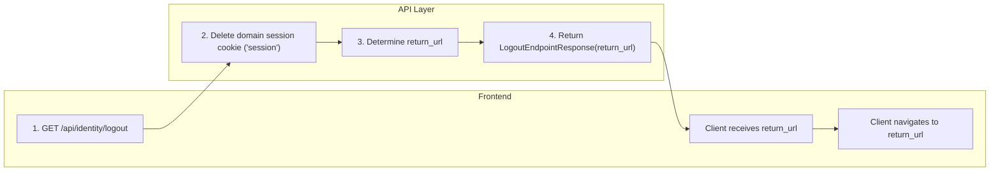

# Frank.Identity — Logout Slice  
## Developer Guide

The **Logout** slice terminates the authenticated session by deleting the domain session cookie (`session`) and returning a post‑logout redirect URL to the client.  
It is intentionally simple: no pipelines, no domain logic, and no persistence.

It spans:

- **API** — `LogoutEndpoint`
- **Application** — `FrontendSettings`
- **Domain** — configuration validation exceptions

---

# 1. End‑to‑End Execution Flow (Swimlane Diagram)



---

# 2. LogoutEndpoint (API Layer)

**Location:**

```
Frank/Identity/Api/Endpoints/LogoutEndpoint.cs
```

**Route:**

```csharp
app.MapGet("/api/identity/logout", HandleAsync)
   .AllowAnonymous();
```

### Responsibilities

- Delete the domain session cookie (`session`)
- Determine the post‑logout redirect URL (`return_url`)
- Validate fallback configuration (`FrontendSettings.BaseUrl`)
- Return `LogoutEndpointResponse(return_url)` to the client

### Key Method

```csharp
private async Task<IResult> HandleAsync(
    HttpContext http,
    IOptionsMonitor<FrontendSettings> frontendOptionsMonitor)
```

---

# 3. Session Cookie Deletion

The Logout slice uses **only the domain session cookie**, not ASP.NET’s cookie authentication.

```csharp
http.Response.Cookies.Delete("session");
```

### Developer Notes

- This is the **only** logout action.
- No server‑side session store is used.
- No pipeline or domain logic is invoked.
- Logout is stateless and idempotent.

---

# 4. return_url Handling

The `return_url` determines where the client should navigate after logout.

### Client‑provided

```csharp
var returnUrl = http.Request.Query["return_url"].ToString();
```

If present and non‑empty, it is used as‑is.

### Default (Frontend base URL)

```csharp
if (string.IsNullOrWhiteSpace(returnUrl))
{
    var frontendBaseUrl = frontendOptionsMonitor.CurrentValue?.BaseUrl;
    if (string.IsNullOrWhiteSpace(frontendBaseUrl))
        throw new BadConfigurationException("Frontend configuration is missing or incomplete.");

    returnUrl = frontendBaseUrl;
}
```

### Developer Notes

- `FrontendSettings.BaseUrl` must be configured.
- Missing or empty base URL → `BadConfigurationException`.
- Unlike Login, Logout does **not** validate `return_url` as a URI; it is treated as a simple redirect target.

---

# 5. Response Shape

```csharp
return Results.Ok(
    new LogoutEndpointResponse(returnUrl));
```

### Developer Notes

- The API does **not** perform the redirect.
- The frontend receives the `return_url` and performs navigation.
- This keeps the API predictable and frontend‑controlled.

---

# 6. Error Handling

The endpoint itself does not throw exceptions except for configuration failures.

### Configuration Errors

Missing or empty `Frontend:BaseUrl`:

```csharp
throw new BadConfigurationException("Frontend configuration is missing or incomplete.");
```

### Client Errors

- Logout does **not** throw for malformed `return_url`.
- The client is responsible for supplying a valid redirect target.

---

# 7. Testing Strategy

## Unit Tests

- Cookie deletion:
  - Ensure `session` cookie is removed.
- `return_url` handling:
  - Client‑provided `return_url` is used.
  - Missing `return_url` falls back to `FrontendSettings.BaseUrl`.
- Configuration validation:
  - Missing `FrontendSettings.BaseUrl` → `BadConfigurationException`.

## Integration Tests

- `/api/identity/logout` returns `200 OK`.
- Response contains:
  - `return_url` matching query parameter OR
  - `FrontendSettings.BaseUrl` fallback.
- Cookie deletion is observable via:
  - Response headers
  - Test server cookie store

---

# 8. Summary

The **Logout** slice:

- Deletes the domain session cookie (`session`)
- Determines the post‑logout redirect URL
- Returns `LogoutEndpointResponse(return_url)`
- Leaves redirect behavior to the frontend

It is intentionally minimal, stateless, and consistent with Frank.Identity’s session model.

