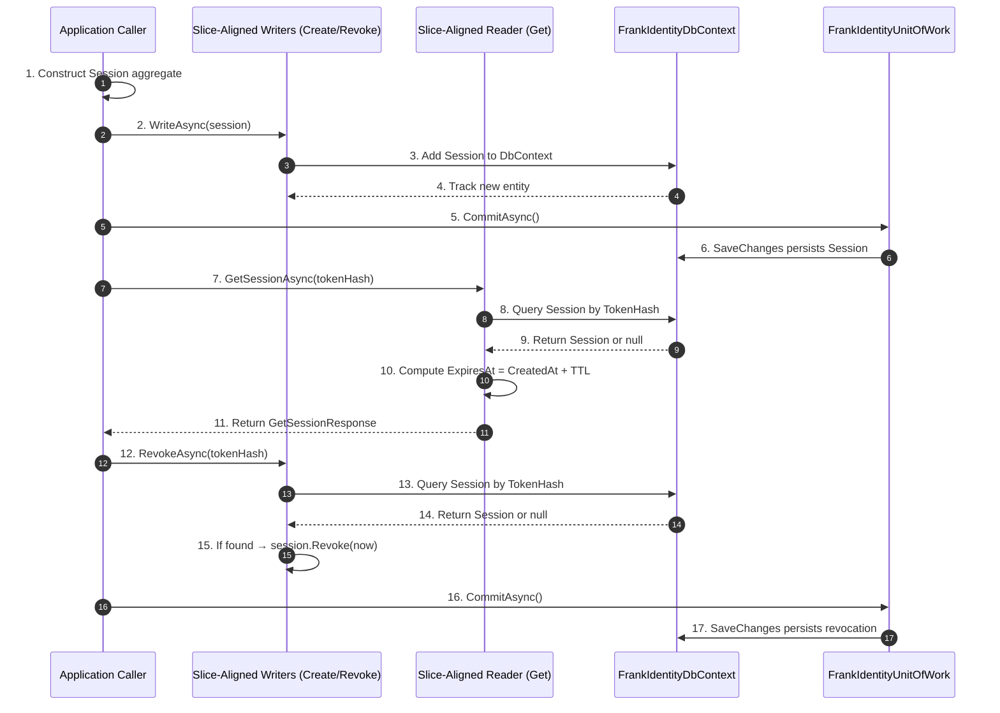

# Frank.Identity — Sessions  
## Overview

The **Sessions** subsystem provides the persistence and lifecycle management for authentication sessions in Frank.Identity.  
A session represents an authenticated identity and is used by middleware, resolvers, and endpoints to determine who the current user is.

Sessions are intentionally simple:

- Represented as a domain aggregate (`Session`)
- Identified by a **hashed token** (`SessionTokenHash`)
- Have a **TTL** (`SessionSettings.Ttl`)
- May be **revoked** (`RevokedAt`)
- Hydrate `ICurrentUser` during request processing
- Persisted and mutated through **slice‑aligned writers**
- Queried through **slice‑aligned readers**
- Committed atomically via **FrankIdentityUnitOfWork**
- Stored and tracked through **FrankIdentityDbContext**

This document provides a complete architectural overview of the Sessions subsystem.

---

# 1. Slice Documents

### **Create Session Slice**  
[📄 create-session/README.md](./create-session/README.md)  
Persists a newly created `Session` aggregate.  
The caller constructs the aggregate; the writer adds it to EF Core’s change tracker.  
Persistence is finalized by **FrankIdentityUnitOfWork**.

### **Get Session Slice**  
[📄 get-session/README.md](./get-session/README.md)  
Retrieves a session by its hashed token.  
Used by authentication middleware and identity resolution.  
Computes expiration (`ExpiresAt = CreatedAt + TTL`) and throws `SessionNotFoundException` when missing.

### **Revoke Session Slice**  
[📄 revoke-session/README.md](./revoke-session/README.md)  
Marks a session as revoked.  
Revocation is idempotent — revoking a non‑existent session is a no‑op.  
Changes are persisted via **FrankIdentityUnitOfWork**.

---

# 2. Domain Layer  
## 2.1 Session Aggregate

The `Session` aggregate represents an authenticated identity.

### Value Objects

- `SessionId`
- `SessionTokenHash`
- `UserId`

### Properties

| Property     | Type                | Description |
|--------------|---------------------|-------------|
| `Id`         | `SessionId`         | Unique session identifier |
| `TokenHash`  | `SessionTokenHash`  | Hashed token used for lookup |
| `OwnerId`    | `UserId`            | User who owns the session |
| `CreatedAt`  | `DateTimeOffset`    | When the session was created |
| `RevokedAt`  | `DateTimeOffset?`   | When the session was revoked (null if active) |

### Behavior

```csharp
session.Revoke(DateTimeOffset.UtcNow);
```

- Sets `RevokedAt`
- Idempotent — calling twice does nothing
- Revoked sessions are invalid for authentication

---

# 3. EntityFrameworkCore Layer  
## 3.1 SessionConfiguration

Configures EF Core mapping for the `Session` aggregate.

### Mapping Summary

| Column        | VO / Type             | Notes |
|---------------|------------------------|-------|
| `id`          | `SessionId`            | Stored as primitive |
| `token_hash`  | `SessionTokenHash`     | Unique index; required |
| `owner_id`    | `UserId`               | Required |
| `created_at`  | `DateTimeOffset`       | Required |
| `revoked_at`  | `DateTimeOffset?`      | Optional |

### Highlights

```csharp
builder.Property(s => s.Id)
    .HasConversion(id => id.Value, value => SessionId.From(value));

builder.Property(s => s.TokenHash)
    .HasConversion(v => v.Value, v => SessionTokenHash.From(v))
    .IsRequired();

builder.HasIndex(s => s.TokenHash)
    .IsUnique();

builder.Property(s => s.OwnerId)
    .HasConversion(v => v.Value, v => UserId.From(v))
    .IsRequired();

builder.Property(s => s.CreatedAt)
    .IsRequired();

builder.Property(s => s.RevokedAt)
    .IsRequired(false);
```

---

## 3.2 FrankIdentityDbContext

The EF Core DbContext for all Identity persistence.

### Responsibilities

- Expose `DbSet<Session>`
- Apply `SessionConfiguration`
- Provide change tracking for writers
- Participate in unit of work boundaries

### Notes

- Writers add aggregates to the DbContext  
- Readers query aggregates from the DbContext  
- DbContext does **not** commit — the UnitOfWork does

---

## 3.3 FrankIdentityUnitOfWork

The unit of work ensures atomic persistence across slices.

### Responsibilities

- Commit all EF Core changes
- Provide transactional boundaries
- Used by all writers (Create, Revoke)

### API

```csharp
Task CommitAsync(CancellationToken ct);
```

### Notes

- Writers never call `SaveChangesAsync`  
- UnitOfWork is the **only** component allowed to commit  
- Supports batching (e.g., user creation + session creation)

---

# 4. Slice Layer  
The Sessions subsystem consists of three slices:

- **CreateSession** — persist a new session  
- **GetSession** — retrieve a session by token hash  
- **RevokeSession** — mark a session as revoked  

Each slice uses:

- **Slice‑aligned writers** (Create, Revoke)  
- **Slice‑aligned readers** (Get)  
- **FrankIdentityDbContext**  
- **FrankIdentityUnitOfWork**

---

# 5. Unified Session Lifecycle (Sequence Diagram)



---

# 6. Related Settings

### `SessionSettings`

| Setting | Description |
|---------|-------------|
| `Ttl`   | Time‑to‑live for sessions; used to compute `ExpiresAt` |

---

# 7. Usage in Identity

Sessions are used by:

- **Login callback pipeline** — creates new sessions  
- **Identity resolver** — loads session to hydrate `ICurrentUser`  
- **Logout** — deletes session cookie  
- **Session revocation** — invalidates sessions  
- **Session refresh** (future slice) — extends TTL  

---

# 8. Philosophy

Frank.Identity sessions are:

- **Minimal** — no complex token formats  
- **Domain‑driven** — aggregates + value objects  
- **Explicit** — revocation is a domain action  
- **Composable** — used by multiple slices  
- **Predictable** — expiration is deterministic  
- **Atomic** — persistence always flows through `FrankIdentityUnitOfWork`  
- **Consistent** — all persistence flows through `FrankIdentityDbContext`

