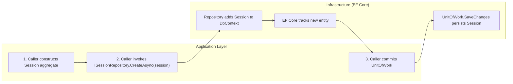

# Frank.Identity — CreateSession Slice  
## Developer Guide

The **CreateSession** slice is responsible for persisting a newly created `Session` aggregate.  
It is intentionally minimal: there is **no handler**, **no pipeline**, and **no domain logic** beyond the aggregate itself.  
Session creation is performed by the caller (e.g., Save Callback Pipeline), and this slice simply persists the aggregate.

It spans:

- **Infrastructure** — `SessionRepository.CreateAsync`
- **Domain** — `Session` aggregate + value objects
- **Unit of Work** — commit performed by caller

---

# 1. End‑to‑End Execution Flow (Swimlane Diagram)



---

# 2. SessionRepository.CreateAsync (Infrastructure Layer)

**Location:**

```
Frank.Identity.EntityFrameworkCore.Sessions.SessionRepository.cs
```

### Responsibilities

- Accept a fully‑constructed `Session` aggregate
- Add it to EF Core’s change tracker
- Defer persistence to the unit of work

### Method

```csharp
public Task CreateAsync(Session session, CancellationToken cancellationToken)
{
    _db.Set<Session>().Add(session);
    return Task.CompletedTask;
}
```

### Developer Notes

- `CreateAsync` does **not** call `SaveChangesAsync`.
- The caller (e.g., Save Callback Pipeline) must commit via `IFrankIdentityUnitOfWork`.
- EF Core tracks the new entity automatically.
- No validation occurs here — validation belongs in the domain aggregate.

---

# 3. Domain Model (Session Aggregate)

### Value Objects

- `SessionId`
- `SessionTokenHash`
- `UserId`

### Properties

- `Id`
- `TokenHash`
- `OwnerId`
- `CreatedAt`
- `RevokedAt` (null for new sessions)

### Developer Notes

- The aggregate is created by the caller (e.g., Save Callback Pipeline).
- Domain invariants (e.g., non‑null owner, valid token hash) are enforced by constructors/VOs.
- `RevokedAt` is null for new sessions.

---

# 4. EF Core Configuration

**Location:**

```
Frank.Identity.EntityFrameworkCore.Sessions.SessionConfiguration.cs
```

### Highlights

```csharp
builder.Property(s => s.Id)
    .HasConversion(id => id.Value, value => SessionId.From(value));

builder.Property(s => s.TokenHash)
    .HasConversion(v => v.Value, v => SessionTokenHash.From(v))
    .IsRequired();

builder.HasIndex(s => s.TokenHash)
    .IsUnique();

builder.Property(s => s.OwnerId)
    .HasConversion(v => v.Value, v => UserId.From(v))
    .IsRequired();

builder.Property(s => s.CreatedAt)
    .IsRequired();

builder.Property(s => s.RevokedAt)
    .IsRequired(false);
```

### Developer Notes

- All value objects are stored as primitive values.
- `TokenHash` is unique — only one active session per token.
- `CreatedAt` is required.
- `RevokedAt` is optional.

---

# 5. Unit of Work

Session creation is finalized by the caller:

```csharp
await _unitOfWork.CommitAsync(ct);
```

### Developer Notes

- Ensures atomic persistence.
- Allows batching multiple operations (e.g., user creation + session creation).
- Keeps EF Core persistence concerns out of the repository.

---

# 6. Error Handling

The CreateSession slice itself does **not** throw exceptions.

Errors arise only from:

### EF Core failures

- Database unavailable
- Constraint violations (e.g., duplicate token hash)
- Invalid VO conversions (rare)

### Caller failures

- Passing an invalid aggregate (domain invariants should prevent this)

---

# 7. Testing Strategy

## Unit Tests

- Repository:
  - Ensure `Session` is added to DbContext.
  - Ensure no SaveChanges is called.
  - Ensure value objects are stored correctly.

## Integration Tests

- Creating a session persists it after unit of work commit.
- Duplicate token hash → database constraint violation.
- Session fields stored correctly:
  - `id`
  - `token_hash`
  - `owner_id`
  - `created_at`
  - `revoked_at` (null)

---

# 8. Summary

The **CreateSession** slice:

- Accepts a fully‑constructed `Session` aggregate
- Adds it to EF Core’s change tracker
- Leaves persistence to the unit of work
- Performs no validation and no domain logic

It is intentionally minimal and is used by the Save Callback Pipeline to create new sessions during login.

