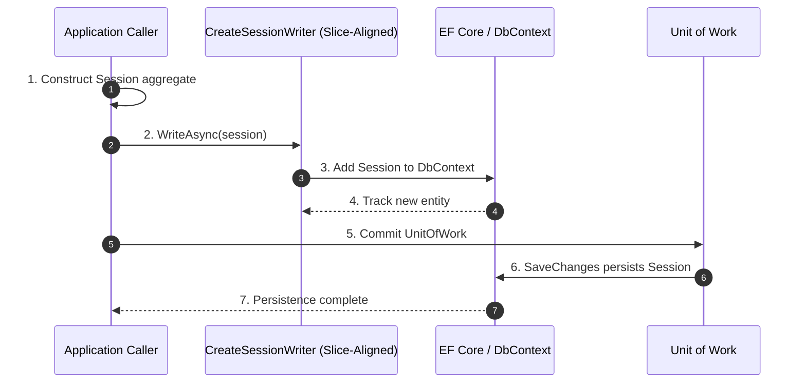

# Frank.Identity — CreateSession Slice  
## Developer Guide

The **CreateSession** slice is responsible for persisting a newly created `Session` aggregate.  
It is intentionally minimal: there is **no handler**, **no pipeline**, and **no domain logic** beyond the aggregate itself.  
Session creation is performed by the caller (e.g., Save Callback Pipeline), and this slice simply persists the aggregate through a **slice‑aligned writer**, not a repository.

It spans:

- **Application Layer** — `ICreateSessionWriter`
- **Domain Layer** — `Session` aggregate + value objects
- **Infrastructure Layer** — EF Core writer implementation
- **Unit of Work** — commit performed by caller

---

# 1. End‑to‑End Execution Flow (Sequence Diagram)



---

# 2. ICreateSessionWriter (Application Layer)

**Location:**

```
Frank.Identity.Application.Abstractions.Sessions.CreateSession.ICreateSessionWriter.cs
```

### Responsibilities

- Accept a fully‑constructed `Session` aggregate  
- Add it to EF Core’s change tracker  
- Defer persistence to the unit of work  

### Interface

```csharp
public interface ICreateSessionWriter
{
    Task WriteAsync(Session session, CancellationToken ct);
}
```

---

# 3. CreateSessionWriter (Infrastructure Layer)

**Location:**

```
Frank.Identity.Infrastructure.Sessions.CreateSessionWriter.cs
```

### Responsibilities

- Implement `ICreateSessionWriter`
- Add the session to the DbContext
- Do **not** commit — caller controls the unit of work

### Implementation

```csharp
public sealed class CreateSessionWriter : ICreateSessionWriter
{
    private readonly IdentityDbContext _db;

    public CreateSessionWriter(IdentityDbContext db)
    {
        _db = db;
    }

    public Task WriteAsync(Session session, CancellationToken ct)
    {
        _db.Sessions.Add(session);
        return Task.CompletedTask;
    }
}
```

### Developer Notes

- Writers replace repositories in the new slice‑aligned architecture.  
- Writers perform **only one responsibility**: write the aggregate.  
- Writers never call `SaveChangesAsync`.  
- Writers never perform domain validation — that belongs to the aggregate.

---

# 4. Domain Model (Session Aggregate)

### Value Objects

- `SessionId`  
- `SessionTokenHash`  
- `UserId`

### Properties

- `Id`  
- `TokenHash`  
- `OwnerId`  
- `CreatedAt`  
- `RevokedAt` (null for new sessions)

### Developer Notes

- The aggregate is created by the caller (e.g., Save Callback Pipeline).  
- Domain invariants are enforced by constructors and value objects.  
- `RevokedAt` is null for new sessions.

---

# 5. EF Core Configuration

**Location:**

```
Frank.Identity.EntityFrameworkCore.Sessions.SessionConfiguration.cs
```

### Highlights

```csharp
builder.Property(s => s.Id)
    .HasConversion(id => id.Value, value => SessionId.From(value));

builder.Property(s => s.TokenHash)
    .HasConversion(v => v.Value, v => SessionTokenHash.From(v))
    .IsRequired();

builder.HasIndex(s => s.TokenHash)
    .IsUnique();

builder.Property(s => s.OwnerId)
    .HasConversion(v => v.Value, v => UserId.From(v))
    .IsRequired();

builder.Property(s => s.CreatedAt)
    .IsRequired();

builder.Property(s => s.RevokedAt)
    .IsRequired(false);
```

### Developer Notes

- All value objects are stored as primitives.  
- `TokenHash` is unique — only one active session per token.  
- `CreatedAt` is required.  
- `RevokedAt` is optional.

---

# 6. Unit of Work

Session creation is finalized by the caller:

```csharp
await _unitOfWork.CommitAsync(ct);
```

### Developer Notes

- Ensures atomic persistence.  
- Allows batching multiple operations (e.g., user creation + session creation).  
- Keeps EF Core persistence concerns out of writers.

---

# 7. Error Handling

The CreateSession slice itself does **not** throw exceptions.

Errors arise only from:

### EF Core failures

- Database unavailable  
- Constraint violations (e.g., duplicate token hash)  
- Invalid VO conversions (rare)

### Caller failures

- Passing an invalid aggregate (domain invariants should prevent this)

---

# 8. Testing Strategy

## Unit Tests

- Writer:
  - Ensure `Session` is added to DbContext.
  - Ensure no SaveChanges is called.
  - Ensure value objects are stored correctly.

## Integration Tests

- Creating a session persists it after unit of work commit.  
- Duplicate token hash → database constraint violation.  
- Session fields stored correctly:
  - `id`
  - `token_hash`
  - `owner_id`
  - `created_at`
  - `revoked_at` (null)

---

# 9. Summary

The **CreateSession** slice:

- Accepts a fully‑constructed `Session` aggregate  
- Adds it to EF Core’s change tracker via a slice‑aligned writer  
- Leaves persistence to the unit of work  
- Performs no validation and no domain logic  

It is intentionally minimal and is used by the Save Callback Pipeline to create new sessions during login.
