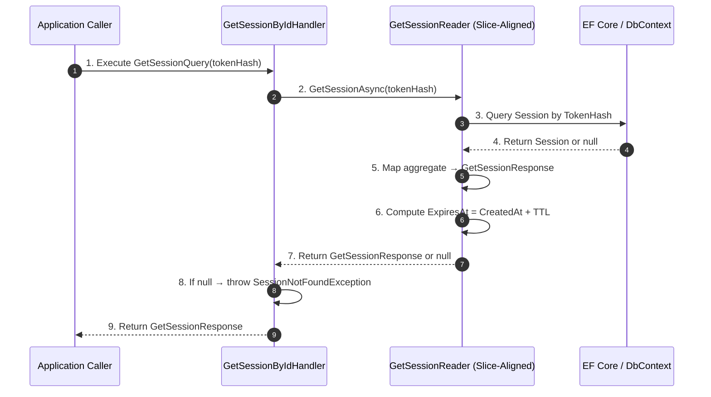

# Frank.Identity — GetSession Slice  
## Developer Guide

The **GetSession** slice retrieves a session by its hashed token.  
It is part of the internal authentication infrastructure and is used by middleware, resolvers, and other identity components that need to validate or hydrate a session.

It spans:

- **Application Layer** — `GetSessionByIdHandler`, `IGetSessionReader`
- **Domain Layer** — `Session`, `SessionTokenHash`, `SessionNotFoundException`
- **Infrastructure Layer** — EF Core slice‑aligned reader (`GetSessionReader`)
- **Settings** — `SessionSettings.Ttl`

---

# 1. End‑to‑End Execution Flow (Sequence Diagram)



---

# 2. GetSessionByIdHandler (Application Layer)

**Location:**

```
Frank.Identity.Application.Sessions.GetSession.GetSessionByIdHandler.cs
```

### Responsibilities

- Handle `GetSessionQuery`
- Delegate to `IGetSessionReader`
- Throw `SessionNotFoundException` when no session exists
- Return `GetSessionResponse` when found

### Key Method

```csharp
public async Task<GetSessionResponse?> HandleAsync(
    GetSessionQuery query, CancellationToken ct)
{
    var result = await reader.GetSessionAsync(query.TokenHash, ct);

    if (result is null)
        throw new SessionNotFoundException();

    return result;
}
```

### Developer Notes

- The handler is intentionally thin.
- All persistence logic lives in the reader.
- All domain validation lives in the aggregate + reader.

---

# 3. IGetSessionReader (Application Abstraction)

**Purpose:**

- Abstracts session retrieval
- Allows EF Core or other persistence mechanisms to implement session lookup
- Returns a DTO (`GetSessionResponse`) rather than a domain aggregate

**Contract:**

```csharp
Task<GetSessionResponse?> GetSessionAsync(string tokenHash, CancellationToken ct);
```

---

# 4. GetSessionReader (Infrastructure Layer)

**Location:**

```
Frank.Identity.EntityFrameworkCore.Sessions.GetSessionReader.cs
```

### Responsibilities

- Query EF Core for a `Session` aggregate by `SessionTokenHash`
- Convert aggregate → `GetSessionResponse`
- Compute expiration using `SessionSettings.Ttl`

### Key Method

```csharp
public async Task<GetSessionResponse?> GetSessionAsync(
    string tokenHash, CancellationToken ct)
{
    var session = await _db.Set<Session>()
        .Where(s => s.TokenHash == SessionTokenHash.From(tokenHash))
        .SingleOrDefaultAsync(ct);

    if (session is null)
        return null;

    return new GetSessionResponse(
        Id: session.Id.Value,
        OwnerId: session.OwnerId.Value,
        CreatedAt: session.CreatedAt,
        RevokedAt: session.RevokedAt,
        ExpiresAt: session.CreatedAt + _ttl);
}
```

### Developer Notes

- `SessionTokenHash` is a value object; comparison is done via VO equality.
- `ExpiresAt` is computed, not stored.
- `RevokedAt` may be null.
- Reader returns `null` instead of throwing; handler throws.

---

# 5. SessionConfiguration (Infrastructure Layer)

**Location:**

```
Frank.Identity.EntityFrameworkCore.Sessions.SessionConfiguration.cs
```

### Responsibilities

- Configure EF Core mapping for `Session` aggregate
- Map value objects (`SessionId`, `SessionTokenHash`, `UserId`)
- Configure required fields and indexes

### Highlights

```csharp
builder.Property(s => s.TokenHash)
    .HasConversion(v => v.Value, v => SessionTokenHash.From(v))
    .HasColumnName("token_hash")
    .IsRequired();

builder.HasIndex(s => s.TokenHash)
    .IsUnique();
```

### Developer Notes

- TokenHash is unique — only one active session per token.
- `CreatedAt` is required.
- `RevokedAt` is optional.
- All IDs are stored as primitive values and reconstructed as VOs.

---

# 6. Domain Model (Session Aggregate)

### Relevant Value Objects

- `SessionId`
- `SessionTokenHash`
- `UserId`

### Relevant Properties

- `Id`
- `TokenHash`
- `OwnerId`
- `CreatedAt`
- `RevokedAt`

### Developer Notes

- The aggregate itself does not compute expiration.
- Expiration is computed by the reader using TTL.
- Revocation is represented by `RevokedAt`.

---

# 7. Error Handling

### SessionNotFoundException

Thrown when:

- No session exists for the given token hash  
- Reader returns `null`

### Null vs Exception

- Reader returns `null` → handler throws  
- This keeps persistence concerns separate from application concerns

---

# 8. Testing Strategy

## Unit Tests

- Handler:
  - Reader returns null → `SessionNotFoundException`
  - Reader returns session → correct `GetSessionResponse`

- Reader:
  - TokenHash lookup works
  - Expiration computed correctly (`CreatedAt + TTL`)
  - Revoked sessions still returned (revocation is separate concern)

## Integration Tests

- Session exists → `GetSessionResponse` returned  
- Session missing → `SessionNotFoundException`  
- TTL applied correctly based on configuration  
- EF Core mapping correctly stores and retrieves value objects

---

# 9. Summary

The **GetSession** slice:

- Retrieves a session by hashed token  
- Uses EF Core to load the `Session` aggregate  
- Computes expiration using TTL  
- Returns a DTO (`GetSessionResponse`)  
- Throws `SessionNotFoundException` when missing  

It is a core building block of Frank.Identity’s session model and is used by middleware, resolvers, and authentication flows.
