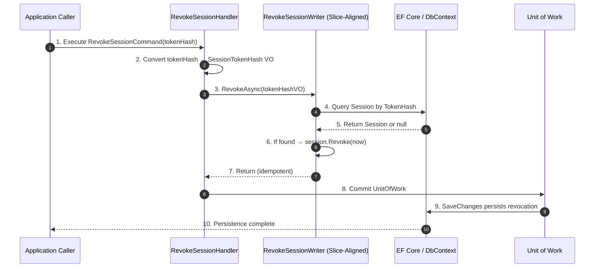

# Frank.Identity — RevokeSession Slice  
## Developer Guide

The **RevokeSession** slice revokes an existing session by marking it as no longer valid.  
It is part of the internal authentication infrastructure and is used by logout flows, admin tools, and session‑management middleware.

It spans:

- **Application Layer** — `RevokeSessionHandler`
- **Domain Layer** — `Session`, `SessionTokenHash`
- **Infrastructure Layer** — EF Core slice‑aligned writer (`RevokeSessionWriter`)
- **Unit of Work** — `IFrankIdentityUnitOfWork`

---

# 1. End‑to‑End Execution Flow (Sequence Diagram)



---

# 2. RevokeSessionHandler (Application Layer)

**Location:**

```
Frank.Identity.Application.Sessions.RevokeSession.RevokeSessionHandler.cs
```

### Responsibilities

- Handle `RevokeSessionCommand`
- Convert raw token hash → `SessionTokenHash` value object
- Delegate revocation to slice‑aligned writer
- Commit changes via `IFrankIdentityUnitOfWork`

### Key Method

```csharp
public async Task HandleAsync(RevokeSessionCommand command, CancellationToken ct)
{
    var tokenHash = SessionTokenHash.From(command.TokenHash);

    await _writer.RevokeAsync(tokenHash, ct);
    await _unitOfWork.CommitAsync(ct);
}
```

### Developer Notes

- Handler does **not** check whether the session exists.
- If the session does not exist, revocation is a **no‑op**.
- Revocation is intentionally **idempotent**.

---

# 3. IRevokeSessionWriter (Application Abstraction)

**Purpose:**

- Abstracts session revocation
- Allows EF Core or other stores to implement revocation
- Exposes:

```csharp
Task RevokeAsync(SessionTokenHash tokenHash, CancellationToken ct);
```

---

# 4. RevokeSessionWriter (Infrastructure Layer)

**Location:**

```
Frank.Identity.EntityFrameworkCore.Sessions.RevokeSessionWriter.cs
```

### Responsibilities

- Query EF Core for a session by `SessionTokenHash`
- Invoke domain behavior (`session.Revoke`)
- Allow EF Core change tracking to persist the update

### Key Method

```csharp
public async Task RevokeAsync(SessionTokenHash tokenHash, CancellationToken ct)
{
    var session = await _db.Set<Session>()
        .SingleOrDefaultAsync(s => s.TokenHash == tokenHash, ct);

    if (session is null)
        return; // idempotent no-op

    session.Revoke(DateTimeOffset.UtcNow);
}
```

### Developer Notes

- Revocation is **domain‑driven**: the aggregate enforces its own invariants.
- EF Core tracks the updated `RevokedAt` timestamp.
- Unit of work commits the change.

---

# 5. Domain Model (Session Aggregate)

### Relevant Value Objects

- `SessionId`
- `SessionTokenHash`
- `UserId`

### Relevant Properties

- `Id`
- `TokenHash`
- `OwnerId`
- `CreatedAt`
- `RevokedAt`

### Domain Behavior

```csharp
session.Revoke(DateTimeOffset.UtcNow);
```

### Developer Notes

- Revocation sets `RevokedAt` to a timestamp.
- A revoked session is invalid for authentication.
- Revocation is **idempotent** — calling it twice does not change behavior.

---

# 6. Unit of Work

The handler commits changes using:

```csharp
await _unitOfWork.CommitAsync(ct);
```

### Developer Notes

- Ensures revocation is persisted atomically.
- Allows batching multiple operations if needed.
- Keeps EF Core persistence concerns out of the handler.

---

# 7. Error Handling

### Session Not Found

- Writer returns silently.
- Handler commits no changes.
- No exception is thrown.

### Why no exception?

- Revocation is intentionally **idempotent**.
- Attempting to revoke a non‑existent session is not considered an error.

---

# 8. Testing Strategy

## Unit Tests

- Handler:
  - Correct conversion of token hash → VO
  - Writer invoked with correct VO
  - Unit of work commit invoked

- Writer:
  - Session found → `RevokedAt` updated
  - Session missing → no exception, no update
  - EF Core tracks changes correctly

## Integration Tests

- Revoking an existing session sets `RevokedAt`
- Revoking a missing session is a no‑op
- Unit of work commits changes
- Revoked sessions are treated as invalid by authentication middleware

---

# 9. Summary

The **RevokeSession** slice:

- Converts raw token hash → `SessionTokenHash`
- Loads session via slice‑aligned writer
- Applies domain revocation behavior
- Persists changes via unit of work
- Treats missing sessions as a no‑op

It is a core building block of Frank.Identity’s session lifecycle and is used by logout flows, admin tools, and session‑validation middleware.
