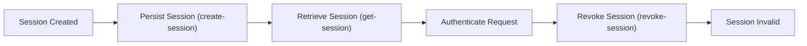

# Frank.Identity — Sessions  
## Overview

The **Sessions** subsystem defines the domain model, persistence, and vertical slices for managing authentication sessions in Frank.Identity.  
A *Session* represents an authenticated identity and is used by middleware, resolvers, and endpoints to determine who the current user is.

Sessions are intentionally simple:

- Represented as a domain aggregate (`Session`)
- Identified by a **hashed token** (`SessionTokenHash`)
- Linked to a user (`UserId`)
- Have a creation timestamp (`CreatedAt`)
- May be revoked (`RevokedAt`)
- Expire deterministically (`CreatedAt + TTL`)

This folder contains documentation for each slice of the session lifecycle, plus the domain model and EF Core configuration.

---

## Contents

### [create-session](./create-session/README.md)
Persists a newly created `Session` aggregate.  
The caller constructs the aggregate; the repository adds it to EF Core’s change tracker.  
Persistence is finalized by the unit of work.

### [get-session](./get-session/README.md)
Retrieves a session by its hashed token.  
Used by authentication middleware and identity resolution.  
Computes expiration (`ExpiresAt = CreatedAt + TTL`) and returns `null` when missing.

### [revoke-session](./revoke-session/README.md)
Marks a session as revoked.  
Revocation is idempotent — revoking an already‑revoked session is a no‑op.  
Changes are persisted via the unit of work.

---

# Domain Aggregate: `Session`

The `Session` aggregate represents an authenticated identity.

### Value Objects

- **SessionId** — unique identifier  
- **SessionTokenHash** — hashed session token  
- **UserId** — owner of the session  

### Properties

| Property     | Type                | Notes |
|--------------|---------------------|-------|
| `Id`         | `SessionId`         | Primary key |
| `TokenHash`  | `SessionTokenHash`  | Unique; used for lookup |
| `OwnerId`    | `UserId`            | Required |
| `CreatedAt`  | `DateTimeOffset`    | Required |
| `RevokedAt`  | `DateTimeOffset?`   | Optional |

### Behavior

```csharp
session.Revoke(DateTimeOffset.UtcNow);
```

- Sets `RevokedAt`
- Idempotent — calling twice does nothing
- Revoked sessions are invalid for authentication

---

# EF Core Configuration

The EF Core configuration ensures correct persistence of the `Session` aggregate and its value objects.

### Table: `sessions`

### Mapping Summary

| Column        | VO / Type             | Notes |
|---------------|------------------------|-------|
| `id`          | `SessionId`            | Stored as primitive |
| `token_hash`  | `SessionTokenHash`     | Required + unique |
| `owner_id`    | `UserId`               | Required |
| `created_at`  | `DateTimeOffset`       | Required |
| `revoked_at`  | `DateTimeOffset?`      | Optional |

### Configuration Highlights

```csharp
builder.Property(s => s.Id)
    .HasConversion(
        id => id.Value,
        value => SessionId.From(value))
    .HasColumnName("id");

builder.Property(s => s.TokenHash)
    .HasConversion(
        v => v.Value,
        v => SessionTokenHash.From(v))
    .HasColumnName("token_hash")
    .IsRequired();

builder.HasIndex(s => s.TokenHash)
    .IsUnique();

builder.Property(s => s.OwnerId)
    .HasConversion(
        v => v.Value,
        v => UserId.From(v))
    .HasColumnName("owner_id")
    .IsRequired();

builder.Property(s => s.CreatedAt)
    .HasColumnName("created_at")
    .IsRequired();

builder.Property(s => s.RevokedAt)
    .HasColumnName("revoked_at")
    .IsRequired(false);
```

### Notes

- All value objects are stored as primitives.
- `token_hash` is unique — only one active session per token.
- EF Core tracks changes; unit of work commits them.
- `RevokedAt` is nullable.

---

# Session Lifecycle Summary



---

# Related Settings

### `SessionSettings`

| Setting | Description |
|---------|-------------|
| `Ttl`   | Time‑to‑live for sessions; used to compute `ExpiresAt` |

---

# Usage in Identity

Sessions are used by:

- **Login callback pipeline** — creates new sessions  
- **Identity resolver** — loads session to hydrate `ICurrentUser`  
- **Logout** — deletes session cookie  
- **Session revocation** — invalidates sessions  
- **Session refresh** (future slice) — extends TTL  

---

# Philosophy

Frank.Identity sessions are:

- **Minimal** — no complex token formats  
- **Domain‑driven** — aggregates + value objects  
- **Explicit** — revocation is a domain action  
- **Composable** — used by multiple slices  
- **Predictable** — expiration is deterministic (`CreatedAt + TTL`)  
