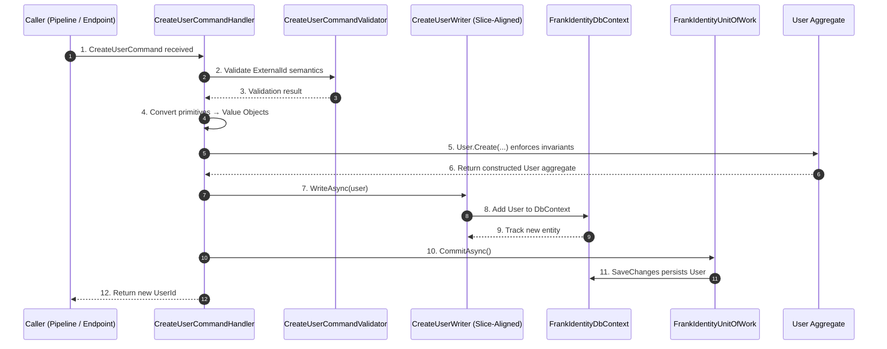

# Frank.Identity — CreateUser Slice  
## Developer Guide

The **CreateUser** slice is responsible for constructing a new `User` aggregate from value objects, validating external identity semantics, and persisting the user through a **slice‑aligned writer** and **FrankIdentityUnitOfWork**.

It spans:

- **Application** — `CreateUserCommandHandler`, `CreateUserCommandValidator`
- **Domain** — `User` aggregate + value objects
- **Infrastructure** — EF Core writer + configuration (`CreateUserWriter`, `UserConfiguration`, `FrankIdentityDbContext`)
- **Unit of Work** — atomic persistence (`FrankIdentityUnitOfWork`)

---

# 1. End‑to‑End Execution Flow (Sequence Diagram)



---

# 2. CreateUserCommandHandler (Application Layer)

**Location:**

```
Frank.Identity.Application.Users.CreateUser.CreateUserCommandHandler.cs
```

### Responsibilities

- Validate cancellation
- Convert primitives → value objects
- Construct the `User` aggregate
- Persist via slice‑aligned writer
- Commit via `FrankIdentityUnitOfWork`
- Return `UserId`

### Key Method

```csharp
public async Task<Guid> HandleAsync(CreateUserCommand request, CancellationToken ct)
{
    ct.ThrowIfCancellationRequested();

    var firstName = FirstName.From(request.FirstName);
    var lastName = LastName.From(request.LastName);
    var email = Email.From(request.Email);
    var externalId = ExternalId.From(request.ExternalId);
    var phone = string.IsNullOrWhiteSpace(request.Phone) ? null : PhoneNumber.From(request.Phone);

    var user = User.Create(firstName, lastName, email, externalId, phone);

    await _writer.WriteAsync(user, ct);
    await _unitOfWork.CommitAsync(ct);

    return user.Id.Value;
}
```

### Developer Notes

- Domain invariants are enforced inside `User.Create`.
- Value objects guarantee syntactic + semantic correctness.
- Handler is intentionally thin — no business logic.

---

# 3. CreateUserCommandValidator (Application Layer)

**Location:**

```
Frank.Identity.Application.Users.CreateUser.CreateUserCommandValidator.cs
```

### Responsibilities

- Validate **semantic** correctness of `ExternalId`
- Ensure external identity format is `"provider|id"`

### Key Rules

```csharp
RuleFor(x => x.ExternalId)
    .NotEmpty()
    .WithMessage("External provider ID is required.");

RuleFor(x => x.ExternalId)
    .Must(id => id.Contains('|'))
    .WithMessage("External provider ID must be in the format 'provider|id'.");
```

### Developer Notes

- Does **not** validate first/last name, email, or phone.
- Those are validated by:
  - Request validators (syntactic)
  - Domain value objects (semantic + invariant)

---

# 4. CreateUserWriter (Infrastructure Layer)

**Location:**

```
Frank.Identity.Infrastructure.Users.CreateUserWriter.cs
```

### Responsibilities

- Add the `User` aggregate to EF Core’s change tracker
- Defer persistence to `FrankIdentityUnitOfWork`

### Method

```csharp
public Task WriteAsync(User user, CancellationToken ct)
{
    _db.Users.Add(user);
    return Task.CompletedTask;
}
```

### Developer Notes

- No `SaveChangesAsync` here — unit of work handles persistence.
- EF Core tracks the new entity automatically.
- Writers are single‑responsibility: **write only**.

---

# 5. UserConfiguration (EntityFrameworkCore Layer)

**Location:**

```
Frank.Identity.EntityFrameworkCore.Users.UserConfiguration.cs
```

### Responsibilities

- Map the `User` aggregate and its value objects
- Configure required fields and unique constraints

### Highlights

```csharp
builder.Property(c => c.Id)
    .HasConversion(id => id.Value, value => UserId.From(value))
    .HasColumnName("id");
```

#### FirstName (required VO)

```csharp
builder.OwnsOne(c => c.FirstName, fn =>
{
    fn.Property(f => f.Value)
      .HasColumnName("first_name")
      .IsRequired();
});
```

#### LastName (required VO)

```csharp
builder.OwnsOne(c => c.LastName, ln =>
{
    ln.Property(l => l.Value)
      .HasColumnName("last_name")
      .IsRequired();
});
```

#### Email (required VO)

```csharp
builder.OwnsOne(c => c.Email, email =>
{
    email.Property(e => e.Value)
        .HasColumnName("email")
        .IsRequired();
});
```

#### Phone (optional VO)

```csharp
builder.Property(c => c.Phone)
    .HasConversion(
        v => v == null ? null : v.Value,
        v => v == null ? null : PhoneNumber.From(v))
    .HasColumnName("phone")
    .IsRequired(false);
```

#### ExternalId (required VO)

```csharp
builder.OwnsOne(c => c.ExternalId, ext =>
{
    ext.Property(e => e.Value)
        .HasColumnName("external_id")
        .HasMaxLength(200)
        .IsRequired();

    ext.HasIndex(e => e.Value)
        .IsUnique();
});
```

### Developer Notes

- All value objects are stored as primitives.
- `external_id` is **required** and **unique**.
- Phone is optional.
- Names and email are required.

---

# 6. Domain Model (User Aggregate)

### Value Objects

- `UserId`
- `FirstName`
- `LastName`
- `Email`
- `PhoneNumber?`
- `ExternalId`

### Behavior

```csharp
User.Create(firstName, lastName, email, externalId, phone);
```

### Developer Notes

- Domain invariants are enforced inside the aggregate.
- Value objects ensure syntactic + semantic correctness.
- External identity is mandatory post–US‑184.

---

# 7. Error Handling

### Validation Errors

- Missing or malformed `ExternalId` → validator failure  
- Invalid VO construction → domain exception  

### Persistence Errors

- Duplicate `external_id` → database constraint violation  
- Database unavailable → EF Core exception  

---

# 8. Testing Strategy

## Unit Tests

- Handler:
  - Correct VO construction
  - Correct aggregate creation
  - Writer + unit of work invoked

- Validator:
  - Rejects missing `ExternalId`
  - Rejects malformed `"provider|id"` formats

- Writer:
  - Adds user to DbContext

## Integration Tests

- Creating a user persists it after unit of work commit  
- Duplicate external ID → unique constraint violation  
- All fields stored correctly:
  - `first_name`
  - `last_name`
  - `email`
  - `phone`
  - `external_id`

---

# 9. Summary

The **CreateUser** slice:

- Validates external identity semantics  
- Converts primitives → value objects  
- Constructs the `User` aggregate  
- Persists via slice‑aligned writer  
- Commits via `FrankIdentityUnitOfWork`  
- Returns the new `UserId`  

It is the foundation of owner identity in Frank.Identity and is used by the login callback pipeline to ensure every external identity maps to a domain user.
