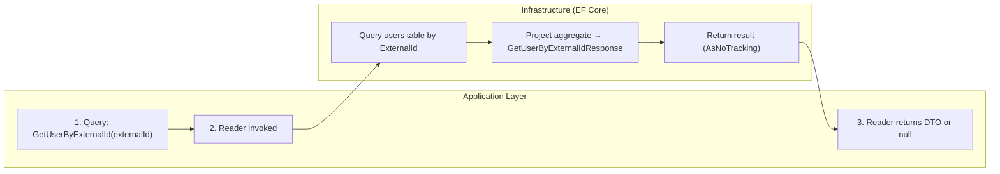

# Frank.Identity — GetUserByExternalId Slice  
## Developer Guide

The **GetUserByExternalId** slice provides read‑side access to users by their external identity (`provider|id`).  
It is used primarily by the **login callback pipeline** to determine whether an external identity already maps to an existing domain user.

This slice is intentionally **read‑only**, **projection‑based**, and **side‑effect‑free**.

---

## 1. End‑to‑End Execution Flow (Swimlane Diagram)



---

## 2. Reader: GetUserByExternalIdReader

**Location:**

```
Frank.Identity.EntityFrameworkCore.Users.GetUserByExternalIdReader.cs
```

### Responsibilities

- Query the `users` table by external identity (`provider|id`)
- Use `AsNoTracking` for read‑only performance
- Project the aggregate into a minimal DTO
- Return `null` when no user exists

### Implementation

```csharp
public Task<GetUserByExternalIdResponse?> GetByExternalIdAsync(
    string externalId,
    CancellationToken ct)
{
    return _db.Set<User>()
        .AsNoTracking()
        .Where(c =>
            c.ExternalId != null &&
            c.ExternalId.Value == externalId)
        .Select(c =>
            new GetUserByExternalIdResponse(
                Id: c.Id.Value))
        .SingleOrDefaultAsync(ct);
}
```

### Developer Notes

- ExternalId is a **required** VO (post–US‑184).
- Unique constraint ensures at most one match.
- Reader returns **only the UserId** — no profile fields.
- This slice is used exclusively for **identity resolution**, not profile lookup.

---

## 3. DTO: GetUserByExternalIdResponse

Minimal response shape:

```csharp
public sealed record GetUserByExternalIdResponse(Guid Id);
```

### Why minimal?

- The login callback pipeline only needs to know whether the user exists.
- Profile data is irrelevant at this stage.
- Keeping the DTO small reduces coupling and improves performance.

---

## 4. Domain Model (User Aggregate)

Relevant properties:

| Property     | Type          | Notes |
|--------------|---------------|-------|
| `Id`         | `UserId`      | Returned by reader |
| `ExternalId` | `ExternalId`  | Required + unique |

### Value Object: ExternalId

- Required for all users (post–US‑184)
- Format validated by `CreateUserCommandValidator` (`provider|id`)
- Stored as a single string column (`external_id`)

---

## 5. EF Core Configuration

The reader relies on the EF Core mapping defined in:

```
Frank.Identity.EntityFrameworkCore.Users.UserConfiguration.cs
```

### ExternalId Mapping

```csharp
builder.OwnsOne(c => c.ExternalId, ext =>
{
    ext.Property(e => e.Value)
        .HasColumnName("external_id")
        .HasMaxLength(200)
        .IsRequired();

    ext.HasIndex(e => e.Value)
        .IsUnique();
});
```

### Developer Notes

- Unique index ensures fast lookup.
- ExternalId is required for all users.
- Stored as a primitive string, reconstructed as VO.

---

## 6. Error Handling

### Not Found

If no user exists for the given external identity:

- Reader returns `null`
- Caller decides what to do:
  - Create a new user  
  - Reject login  
  - Trigger onboarding  

### No Exceptions Thrown

The reader **never throws** for missing users.  
This keeps it predictable and composable.

---

## 7. Testing Strategy

### Unit Tests

- Query returns correct `Id` for existing user
- Query returns `null` for missing user
- VO comparison (`ExternalId.Value == externalId`) works correctly
- Projection into `GetUserByExternalIdResponse` is correct

### Integration Tests

- Unique constraint on `external_id` enforced
- Reader returns correct DTO from database
- Reader returns `null` when no match exists
- `AsNoTracking` ensures no EF Core tracking overhead

---

## 8. Summary

The **GetUserByExternalId** slice:

- Performs external identity resolution  
- Returns only `UserId`  
- Uses `AsNoTracking` for performance  
- Returns `null` when user does not exist  
- Supports the login callback pipeline and onboarding flows  

It is a foundational part of Frank.Identity’s external authentication model.
