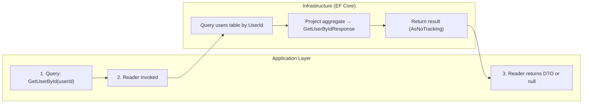

# Frank.Identity — GetUserById Slice  
## Developer Guide

The **GetUserById** slice provides read‑side access to user profile data using the domain `UserId`.  
It is used by authenticated flows, admin tools, and any feature that needs to hydrate a user’s basic profile.

This slice is intentionally **read‑only**, **projection‑based**, and **side‑effect‑free**.

---

## 1. End‑to‑End Execution Flow (Swimlane Diagram)



---

## 2. Reader: GetUserByIdReader

**Location:**

```
Frank.Identity.EntityFrameworkCore.Users.GetUserByIdReader.cs
```

### Responsibilities

- Query the `users` table by `UserId`
- Use `AsNoTracking` for read‑only performance
- Project the aggregate into a lightweight DTO
- Return `null` when no user exists

### Implementation

```csharp
public Task<GetUserByIdResponse?> GetByIdAsync(
    Guid userId,
    CancellationToken ct)
{
    return _db.Set<User>()
        .AsNoTracking()
        .Where(c =>
            c.Id == UserId.From(userId))
        .Select(c =>
            new GetUserByIdResponse(
                Id: c.Id.Value,
                FirstName: c.FirstName.Value,
                LastName: c.LastName.Value))
        .SingleOrDefaultAsync(ct);
}
```

### Developer Notes

- Uses VO equality (`UserId.From(userId)`).
- Returns `null` when user does not exist.
- Only returns **Id**, **FirstName**, **LastName** — intentionally minimal.
- This slice is for **profile lookup**, not identity resolution.

---

## 3. DTO: GetUserByIdResponse

Minimal profile projection:

```csharp
public sealed record GetUserByIdResponse(
    Guid Id,
    string FirstName,
    string LastName);
```

### Why minimal?

- Most consumers only need basic profile data.
- Email, phone, external identity, etc. are intentionally excluded.
- Keeps the slice focused and predictable.

---

## 4. Domain Model (User Aggregate)

Relevant properties:

| Property     | Type          | Notes |
|--------------|---------------|-------|
| `Id`         | `UserId`      | Returned by reader |
| `FirstName`  | `FirstName`   | Required VO |
| `LastName`   | `LastName`    | Required VO |

### Value Objects

- `UserId`
- `FirstName`
- `LastName`
- `Email`
- `PhoneNumber?`
- `ExternalId`

Only the first three are used in this slice.

---

## 5. EF Core Configuration

The reader relies on the EF Core mapping defined in:

```
Frank.Identity.EntityFrameworkCore.Users.UserConfiguration.cs
```

### Highlights

#### FirstName (required VO)

```csharp
builder.OwnsOne(c => c.FirstName, fn =>
{
    fn.Property(f => f.Value)
      .HasColumnName("first_name")
      .IsRequired();
});
```

#### LastName (required VO)

```csharp
builder.OwnsOne(c => c.LastName, ln =>
{
    ln.Property(l => l.Value)
      .HasColumnName("last_name")
      .IsRequired();
});
```

### Developer Notes

- All value objects are stored as primitives.
- Required fields ensure GetUserById always returns valid profile data.
- `AsNoTracking` ensures no EF Core tracking overhead.

---

## 6. Error Handling

### Not Found

If no user exists for the given `UserId`:

- Reader returns `null`
- Caller decides whether to:
  - Throw a `UserNotFoundException`
  - Return a 404
  - Handle gracefully

### No Exceptions Thrown

The reader **never throws** for missing users.  
This keeps it predictable and composable.

---

## 7. Testing Strategy

### Unit Tests

- Query returns correct DTO for existing user
- Query returns `null` for missing user
- VO comparison (`UserId.From(userId)`) works correctly
- Projection into `GetUserByIdResponse` is correct

### Integration Tests

- Reader returns correct DTO from database
- Reader returns `null` when no match exists
- EF Core mapping correctly stores and retrieves:
  - `first_name`
  - `last_name`
  - `id`

---

## 8. Summary

The **GetUserById** slice:

- Performs profile lookup by `UserId`  
- Returns a minimal profile DTO  
- Uses `AsNoTracking` for performance  
- Returns `null` when user does not exist  
- Supports authenticated flows, admin tools, and profile hydration  

It is a foundational part of Frank.Identity’s user‑profile read model.
